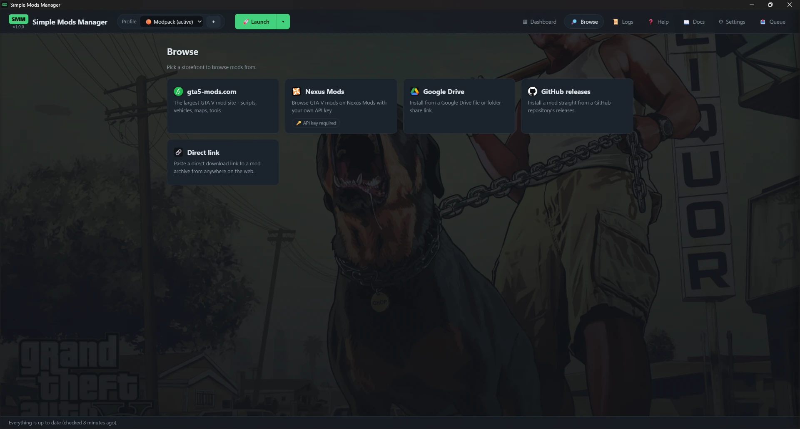

# Browsing & downloading

The Browse tab opens on a set of **storefront tiles**: gta5-mods.com,
Nexus Mods, **Google Drive**, **GitHub releases** and **Direct link**. Click a
tile to enter that store; the **‹ Stores** button brings you back. The Google
Drive, GitHub and Direct-link tiles are different - they open a paste prompt
instead of a store (see below).

*Nexus Mods is marked **API key required** - it needs your own free key once,
and the app walks you through it.*

Inside gta5-mods.com you can search or browse in grid or list view, with a
real page navigator (also on the featured page) and filters that run on the
site itself: **Category**, **Sort**, **Uploaded** (yesterday / last week /
last month) and a free-text **Tag** (e.g. `trainer`, `.net`, `car` -
capitalization and spaces don't matter, "Rage Plugin Hook" works).
Click a mod to open its **full detail page** - a large preview, the complete
description, and version/profile pickers, with **Download & Install** and
**📥 Add to queue** on a rail that stays in view as you read. Or skip the page
entirely: every result card has its own **📥 Queue** and **Install** buttons, so
you can add a mod straight from the grid. Either way the wizard opens at the
right step if anything conflicts. A card you've already queued is marked with a
green **✓ queued**, so you can see what you've picked as you keep browsing.

Some mods keep their files on a different website, so there's nothing for Simple
Mods Manager to download from the mod page. Those are flagged with a **Download
location invalid** badge and their **Queue** / **Install** buttons are greyed out
(the first time you hit one, a note tells you and offers to open the mod page so
you can grab it by hand). They stay in your results - just open the page and
download them yourself. You can switch this flagging off, or clear it, under
**Settings → Mark un-downloadable mods in Browse**.

The detail page shows the full description (always fully expanded), a
**Source ↗** button that opens the mod's own page in your browser, and
**‹ Back to results** to return to exactly the grid you left - it sits both at
the top of the page and on the action rail that stays in view as you scroll. Web links in the description are handled for you: a link to
another **gta5-mods.com or Nexus Mods** mod becomes a small **🔗 open in SMM**
button that opens that mod right here in the app, as if you had browsed to it -
handy for requirements like Script Hook V or an author's companion mods. When
you follow one of these, a **← Back** button appears so you can return to the
mod you came from (it remembers the whole trail). Every other link (Discord,
homepages…) opens in your normal browser, never inside the app.

## Nexus Mods

The first time you open the Nexus tile, SMM asks for your **personal API
key** - you find it on your Nexus Mods account's API keys page (the modal
links straight to it). The key is stored in SMM's data folder on your
machine and only ever sent to nexusmods.com. Once connected you can search
and browse GTA V mods with a **category** filter (the site's own categories -
Vehicles, Scripts, Maps, …), sort options (latest added, recently updated,
most endorsed, most downloaded) and an adult-content toggle.

Downloading depends on your account type:

- **Premium** accounts download in-app, exactly like gta5-mods.com.
- **Free** accounts can't get direct downloads from the Nexus API (that's a
  Nexus rule, not an SMM one). The download button becomes **Open website ↗**:
  finish the download in your browser as usual - SMM watches your Downloads
  folder and stages the file into your chosen profile automatically the
  moment it lands, then opens the install wizard.

## GitHub releases - install from a repository

Some mods and script libraries are published straight on GitHub. Paste the
repository's link into the **GitHub releases** tile (any form works -
`https://github.com/author/mod-name`, its `/releases` page, even a link to one
release file) and SMM lists the repository's release files so you can **pick a
version**; the newest release's package is pre-selected. The download is
virus-scanned and lands in the **📥 install queue** (click the 📥 button to
review the queue and run the install wizard), and because a release carries a
real version number, **GitHub installs get update checks** - when the author
publishes a newer release, the mod shows an Update button like any store
install.

One honest warning, every time: **GitHub hosts arbitrary software.** There is
no mod category and no game tag - SMM cannot verify a repository has anything
to do with GTA V (please don't install cURL). Only install releases from
authors you trust; the installed mod carries this reminder in its install
notes.

## Direct link - install from anywhere on the web

Some mods don't live on a mod site at all - an ENB preset on its author's own
page, a tool published as a GitHub release file. The **🔗 Direct link** tile
takes a **direct download link** to the archive itself: a link ending in
`.zip`, `.rar`, `.7z` or `.oiv` (on most sites: right-click the download
button and copy the link), or a site's download button link that redirects to
the file - gta5mod.net's `download-mod` links, for example. Either way SMM
checks that what the server actually sends is a real archive, never a web
page. SMM downloads it, virus-scans it like every other
install, and adds it to the **📥 install queue** - open the queue to run the
install wizard on it.

Be aware of what a bare link **cannot** give you, and what SMM is honest
about instead of guessing:

- **No trust check.** SMM can't verify the author, the content, or that it's
  a GTA V mod at all - only use links from sites you trust. The installed mod
  carries this reminder in its install notes.
- **No update checks.** There is no page behind the link to ask for a newer
  version, so a direct-link mod never shows an Update button.

Sharing still works, though: because SMM remembers the link it downloaded from,
a direct-link mod **travels in an exported profile** like any store mod and is
fetched again on import - your friend doesn't have to hunt it down by hand. (Only
a mod you added from a file already on your disk has no link to remember, and
that one is listed by name for the importer to find themselves.)

## Google Drive - install from a Drive file or folder

Plenty of mods are shared as a **Google Drive** link. The **Google Drive** tile
takes a share link to a single file (`.../file/d/…`) **or a whole folder**
(`.../drive/folders/…`) - a folder is downloaded and installed as one mod (SMM
zips its contents and runs them through the normal scan, so archives inside are
unpacked and non-mod files ignored). It's virus-scanned like every other install
and lands in the **📥 install queue**.

Downloading a Drive *folder* means listing its files first, and Google only lets
you do that reliably with an **API key**:

- **With a Google API key (recommended for folders).** In the Drive prompt, open
  *Google API key* and paste one - SMM then uses Google's official Drive API, which
  lists and downloads folders reliably. You create the key once, free, in the
  [Google Cloud Console](https://console.cloud.google.com/) (make a project, enable
  the **Google Drive API**, then create an API key). SMM stores it like your other
  settings; you only do this once.
- **Without a key.** SMM falls back to reading the public share page directly. This
  needs no setup and works for single files, but Google frequently changes and
  rate-limits its folder pages, so **folder** downloads can fail - if one does, SMM
  tells you to add an API key.

The same honesty rules as a direct link apply: SMM can't verify the author or that
it's a GTA V mod (the install notes say so), there are no update checks, and - for
your safety - SMM will refuse a link that needs sign-in or isn't shared with
"anyone with the link".

## The install queue - install several mods at once

Both the detail page and every result card have a **📥 Queue** button (the
detail page remembers the version you picked in the dropdown), and you can keep
browsing - across all the storefronts. Each mod downloads and stages **in the
background** the moment you queue it - several at once when you queue quickly -
so by the time you're done shopping everything is ready. A queued
mod's **Queue** and **Install** buttons rest until you remove it from the queue
- one mod, one pending copy. The **📥 button in the top bar** (next to
Settings, visible on every view) counts what is waiting and pulses while
something is still running; click it to slide out the **queue & activity
drawer**. Its top section lists the background work: each running download
with a live progress bar and a ✕ to cancel it, finished ones with their
result, and a *Clear finished* to tidy up. Below that sits the install
queue itself - every queued mod listed, each with a ✕
to drop it and a link back to its source. **Install queued mods »** hands the
whole set to the wizard, where you walk the usual Conflicts → Install steps
once, with all conflicts resolved together.

**The queue survives a restart.** Close the app with mods still queued and
they are simply there again next time, with a "Restored N queued mods from
your last session" note - nothing to redo. If a queued mod's files went
missing in between (a cleaned temp folder, say), it is dropped and the note
names it rather than pretending it's still ready. Conflict choices you had
already made are restored too; any that no longer apply are dropped, and
the wizard's Conflicts step tells you to have another look instead of
silently deciding for you.

Mods always install into one of **your** profiles - the built-in *Default*
profile is the untouched stock game. If it is your current install target when
you press Queue or Install, SMM shows a note asking you to switch to (or
create) a mod profile first.

## Dependencies - installing what a mod needs

Some mods need **other mods** to work (a map that needs a water mod, a script that needs a
library). When a mod you're installing points at other **gta5-mods.com** mods - either the
author listed them, or its page description links to them - SMM shows a short **checklist**
so you can install them in the same step. The ones the mod clearly requires are ticked for
you; untick anything you already have, tick anything else you want, and SMM downloads and
installs them alongside the main mod.

Only gta5-mods.com mods can be installed this way. And SMM will **never** install
ScriptHookV or a rival mod-loader as a dependency - it already provides and manages those
itself, so it quietly leaves them off the list.

## Choosing versions on gta5-mods.com

**Enhanced version, picked for you.** Many mods offer more than one download -
often an **Enhanced** version for GTA V Enhanced and an older **Legacy** version.
The Legacy one usually loads but then **crashes when you use it**. The mod's own
big Download button frequently points at the Legacy
file, so the manager instead shows a **Version** dropdown and **defaults to the
latest Enhanced version** for you. You can still pick a different version if you
really want to - you'll get a heads-up if it's a Legacy one. When a mod only has a
Legacy version, it downloads but warns you it may not work on Enhanced.

**A version that isn't downloadable yet.** gta5-mods lists a newly uploaded file
before a moderator has approved it - you can see its name, size and date, but the
site gives it no download link at all, so nobody can fetch it yet. Simple Mods
Manager shows such a version in the dropdown greyed out and marked *awaiting
approval*, installs the newest **approved** file instead, and tells you it did.
Check back later and use **Update** on the mod once it goes live. Nothing is
broken here and there is nothing to retry - the file genuinely isn't being served
yet.
