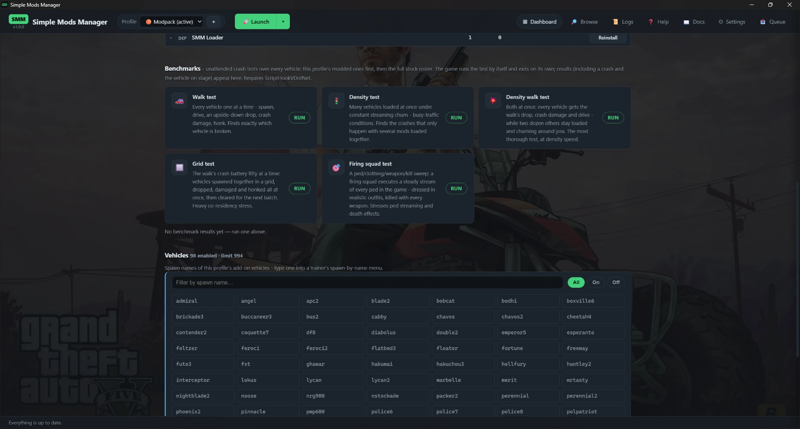

# Profiles & dashboard

## Dashboard

One card per profile with a **health dot**:

| Dot | Meaning |
|-----|---------|
| 🟠 orange | unknown state: never launched yet - or it crashed and you changed the profile since (fixed it?), so launch again to re-check |
| 🟢 green | launched at least once; the last run produced no crash signals |
| 🔴 red | since the last launch a crash was detected: a crash dump appeared, Windows recorded the game crashing, the loaders logged fatal errors, or the game exited within seconds of starting |

A red profile does **not** stay red after you act on it: installing,
uninstalling or updating anything in it turns the dot orange ("changed since
the crash") - the next launch decides whether it goes green again.

A card can also carry an **older SMM** badge: the profile's mods were installed
by an earlier version of Simple Mods Manager, from before the current
mod-conversion fixes. Everything still works exactly as it did - the badge just
means a **reinstall of its mods** would rebuild them with every fix shipped
since (hover it to see which version built the profile). It appears on modpacks
you import, too, when they were built with an older version. Installing or
updating a mod in the profile with the current version clears it; simply
changing a setting does not, because that converts nothing.

Click a card to open the **profile view**, laid out as one full-width column:
health with evidence, then the **Actions**, in three rows - **Profile**
(*Switch to*, *Launch*, *Rename*, *Export*, *Delete*), **Mods & tools**
(*Browse mods*, *Install from folder*, *Menyoo*, *Game folder* which opens it in
Explorer, and *Updates*) and **Graphics** (*NaturalVision*) - then the
**Hard dependencies** panel, then
**Installed mods & configs**, then **Benchmarks**, then this profile's
**Restore points**, and - when the profile installs add-on vehicles - a
**Vehicles** section at the end.

**Installed mods & configs** lists each mod with a quick summary (how many files, how many config files, and a warning
if any of its files are missing), its own **config files** shown right underneath
it, and a **Show files** expander. A **filter box** appears above the list once
it's long, so you can find a mod by its name, one of its files, or a config path.
Next to it a **sort dropdown** orders the list by name (A→Z or Z→A) or by when you
installed each mod (newest or oldest first) - handy for finding the mod you just
added. The filter and sort both apply to the card and table views, and your sort
choice is remembered.

**A mod's name links back to where it came from.** If Simple Mods Manager knows the
mod's page - anything you downloaded through Browse, or installed from a link you
pasted - clicking the name opens it. gta5-mods and Nexus Mods pages open **inside**
the app, on the same page you'd browse to, so you can check for a newer version or
read the description without leaving. Anything else (a GitHub release, a Google
Drive folder, a direct link) opens in your normal web browser, marked with an ↗. A
mod you scanned in from your Downloads folder has no page to point at, so its name
is just text.

Each mod has an **On / Off** switch to turn it off without uninstalling - good for
narrowing down which mod causes a problem, or parking one you don't want right now.
Off sets the mod's files aside (rpf content goes back to stock, scripts stop loading);
On puts them back exactly as they were. The mod stays in the list, greyed, ready to
switch back on, and its off state travels with the profile when you export it. Hard
dependencies and the SMM Loader have no switch - every profile needs them. As with the
vehicle switches, turn a mod off while the game is closed.
**🎛 Menyoo in one click.** [Menyoo](https://www.gta5-mods.com/scripts/menyoo-2-0)
is the trainer most people want in a modded profile - spawning vehicles, changing
the weather, the Spooner. The **Menyoo** tile in *Mods & tools* installs it into
the open profile straight from the mod's own release page, and once it's there the
same tile reads **Remove Menyoo** and takes it back out again. It is **not**
required: a profile without it works exactly as before, and it's per profile, so
you can have it in your test profile and not in the one you play. Once installed
it behaves like any other mod - it's in the list, it can be switched Off, and it
gets an **Update** button when a new release comes out. Removing it also removes
the `menyooStuff` folder, so export any saved vehicles, outfits or Spooner maps
you want to keep first.

**🌆 NaturalVision Enhanced.** [NVE](https://www.razedmods.com/gta-v) is the
complete visual overhaul for GTA V Enhanced, and Razed Mods distributes it
themselves - Simple Mods Manager can't download it for you. The
**NaturalVision** tile in *Graphics* walks you through it instead: download the
mod from the official site (the tile opens it), put the download in your
Downloads folder - or a dedicated empty folder - and then use **Install from
folder** to point Simple Mods Manager at it. The scan stages and installs
everything, converts the packs to the game's native format, and serves them
like any other mod.

The app remembers which profile you had open: coming back to the dashboard -
even after a restart - returns to that profile's view; the **← Dashboard**
button takes you to this overview.
**The order the profiles are listed in** is yours to choose in
Settings → **Profile order**: *last played first* (the default), *name A → Z* or
*name Z → A*. **Default** is always listed first whichever you pick - it's the
stock, unmodded game and the thing you go back to, so it stays where you can
find it. A profile you've never launched sorts to the end of the "last played"
list, because there's nothing to sort it by yet. The order applies everywhere
profiles are listed: this grid, the profile picker at the top, the launch menu
and the wizard's *Install into*.

The **＋ New profile** card creates
one, and **Import profile…** restores one from a `.smmprofile` file.
**🔍 Scan downloads…** asks which profile to install into, then scans your
downloads folder right away and opens the install wizard with the results.

## Vehicles - what to type in the trainer

A profile that installs add-on vehicle packs gets a **Vehicles** section in its
profile view: every installed vehicle's **spawn name** (e.g. `revueltosec`,
`sxkim38`), which is exactly what you type into a trainer's spawn-by-name menu.

*The benchmark tiles and the spawn-name list of a profile with a large vehicle
pack installed. The heading counts what is enabled against the game's limit.*

Next to the heading you'll see how many vehicles are installed and the game
limit they run under - SMM raises that limit automatically at launch so a big
pack never overflows it, so the numbers are informational, not a warning.

**Switching a vehicle off.** Click a spawn-name chip to toggle that vehicle
**off** for this profile - it turns dimmed and struck-through, and the count
drops by one. The pack stays installed and every other vehicle in it keeps
working; SMM just serves a copy of the pack with that one car removed, so it no
longer loads or counts against the game limit. Click it again to switch it back
on. Handy for a huge pack like IVPack when one car misbehaves or you simply
don't want it - no need to uninstall the whole pack. The choice is saved with
the profile and travels with it on export/import. (Changes apply on the next
launch, so switch a vehicle while the game is closed.)

**Replace vehicles.** Some mods don't add a new car - they **replace** a stock
one (say, a modded Adder in place of the vanilla Adder). Those chips are shown
with a **dashed underline**. Switching one off doesn't remove a car; it puts the
**original stock vehicle back** for this profile, and switching it on again
restores the mod. The mod stays installed either way, and reverting to stock
doesn't count against the vehicle limit (it was never an extra car).

**Spawning add-on vehicles in the world.** Add-on vehicles don't join ambient
traffic by themselves - the
[All MP Vehicles in SP](https://www.gta5-mods.com/scripts/all-mp-vehicles-in-sp)
script does that from its `NewVehiclesList.txt` spawn list. When that mod is
installed in the profile, the Vehicles section shows a **📝 Sync spawn list**
button: one click adds every installed add-on vehicle to the list as
`spawnname,class` (the class comes from the vehicle pack itself; when a pack
doesn't declare one, SMM picks the closest - it only affects *where* the car
spawns, never how it drives). Your existing list entries and hand edits are
kept, a backup is taken first, and re-running it keeps the list in step both
ways: new vehicles are appended, and entries for synced vehicles you have
since uninstalled or switched off are removed again (the mod's stock list and
entries about anything SMM doesn't manage are never touched).

**Spawning from the Native Mod Menu.** The same one-click sync exists for
[NativeCoder's Native Mod Menu](https://www.gta5-mods.com/scripts/native-mod-menu-asi-enhanced-nativecoder):
when its `menu.ini` is installed in the profile, a **🧾 Sync Native Menu**
button appears next to the spawn-list one. It adds every installed add-on
vehicle to the menu's `[Addon_Vehicles]` list in the ini's own numbered
format, keeps your existing entries and the menu's *add more vehicles here*
hint in place, and takes a backup first. Re-running keeps the menu in step
both ways - new vehicles appear, entries for synced vehicles you have since
removed disappear - and the numbering is always kept gap-free (the menu stops
reading at a gap), so it's safe to press any time.

**Spawning from Menyoo.** Same again for [Menyoo](https://www.gta5-mods.com/scripts/menyoo-2-0),
which you can install straight from the profile's **Actions** card (see below).
With Menyoo in the profile, a **🎛 Sync Menyoo** button appears: it adds every
installed add-on vehicle to Menyoo's own added-vehicle list, so they show up
under *Vehicle Spawner* in the menu instead of having to be typed in by hand.
Menyoo only writes that list once you add a vehicle yourself, so SMM creates it
if it isn't there yet. Vehicles **you** added in Menyoo are never touched, a
backup is taken first, and re-running keeps it in step both ways.

**Benchmarks.** Its own section, below the installed mods. Five tiles put the
profile through an automated crash test - useful after installing a
big pack, or when the game keeps crashing and you want to
know which mod is to blame. The four vehicle tests cover **every vehicle in the
game**: this profile's modded vehicles first (all add-ons plus any stock
replacements, regenerated from what is installed at that moment - newly installed
mods are automatically included), then the full stock roster. The fifth (Firing
squad) does the same for **peds**.

"Stock replacements" includes the ones you cannot see in a file list. Some packs
don't add a new car - they **replace** an existing one, shipping the vanilla
car's own files under its own name (Vanillaworks Extended replaces 52 stock
vehicles that way). SMM finds those inside the pack and tests them alongside the
add-ons, because the game will load them from ordinary traffic whether the test
asks for one or not.

- **Walk** tests vehicles one at a time: each one is spawned, driven, dropped
  upside down from 8 metres, crash-damaged and honked. If one vehicle is
  broken, this finds *which one*.
- **Density** keeps many vehicles loaded at once while constantly swapping in
  the next - the kind of load the game experiences in busy traffic. It catches
  the crashes that only happen when several vehicles are loaded together,
  which the one-at-a-time walk can't.
- **Density walk** combines the two: every vehicle that streams in gets the
  walk's drop, crash damage and drive - while two dozen others stay loaded
  and churning around you. The most thorough test, and far faster than the
  one-at-a-time walk because the tests run on many vehicles at once.
- **Grid** runs the walk's crash test fifty vehicles at a time: 50 are
  spawned together in a grid, dropped upside down, damaged and honked all at
  once, then cleared for the next 50. It pushes the game hardest on how many
  vehicles can be loaded side by side - if the resident set lists what was up
  when it crashed, those are the suspects.
- **Firing squad** tests *peds* instead of vehicles, in two stages. First, **100 peds**
  are lined up - 50 in front of you and 50 behind - and gunned down one wave at a time, every
  ped in the game taking its turn, while the shooters cycle through every weapon (yours
  included). Two freemode survivors are left standing. Then the survivors are joined by **48
  more male and 48 more female** freemode characters, and between them they wear **every
  single clothing item** in the game - every outfit, hair, beard and accessory, vanilla and
  modded - split up so nothing is tested twice. It stresses ped loading, the death/blood
  effects and exhaustive clothing streaming - if the game struggles with a ped mod, a
  clothing item or a weapon, this finds it.

Whatever the test, its main job is to **catch a crash and record it**. A benchmark
run automatically turns on the full crash logging (you don't need the Diagnostics
setting on), so when the game does crash mid-test SMM writes a crash dump
(`SMMCrash.dmp`, next to the game) and points at it on the result card, along with
the exact vehicle or ped that was on stage and everything loaded at the time.

After you confirm, the game starts on this profile (switching to it first if
needed) and **runs the whole test by itself - don't touch it while it runs**.
It closes on its own when the test finishes, and the small test script SMM
placed in the game's `scripts` folder is removed again as soon as the session
ends - finished or crashed, nothing is left behind. The result appears under
the tiles the moment the game closes: a pass, or - just as valuable - *crashed
at vehicle X*, naming the exact vehicle (and for density runs, everything
loaded at that moment). Each result row has a **📜 Log** button with the raw
test trail behind the verdict.

A result can also report **models the game never registered**. Those are
vehicles the pack was supposed to deliver and the game has never heard of - so
the test walked straight past them. This is shown even when the run passes,
because a pass that skipped half a pack is not a pass: the mod needs looking at,
not the test. A crash doesn't lose the result, and every new
run starts fresh from the first vehicle. Requires the Script Hook V .NET
dependency in the profile, and expect a full walk to take a good while (a
second or two per vehicle, over every vehicle in the game); the density test's
in-game progress bar shows how many vehicles have cycled and an estimate of
the minutes left, measured from your machine's actual streaming speed.

**Restore points.** Below the benchmarks, each profile lists its own restore
points - the snapshots of its game files taken automatically before every
install and profile switch (and any you created by hand). Each card shows when
the point was taken and what it covers, with a **Restore** button that
previews exactly which files roll back before touching anything. Because
restoring rewrites the *live* game folder, Restore (and creating a new point)
is only offered on the profile you're currently playing - on any other profile
the list is there to review and tidy (the ✕ deletes a point). Points made by
older versions of SMM didn't record their profile yet, so they show under
every profile until they age out. The 6 most recent points are kept across all
profiles - when a new one is made, the oldest beyond six is removed so they
don't pile up.

Profiles that contain mods show a ⚠ marker (and an amber note in the profile
view): modding is at your own risk - neither the mod authors nor the author
of this tool are responsible for damage to your game. Click it for the full
note. Downloads and installs run in the background (the 📥 drawer tracks
them), but the operations that rework the whole game folder - switching
profiles, restoring a restore point, importing a profile - still hold a
progress window while they run, so nothing can interfere halfway.

That window has **two bars**: the top one says which step is running, the one
underneath says what it's working on right now - the file being saved, the
archive being rebuilt. Switching a big profile genuinely takes a while (every
file is checked and copied, and several GB of game archives can be rebuilt), so
the second bar is there to show it is still moving. If it looks slow, look at the
lower line: it changes constantly.

## Editing mod settings (config files)

Most mods ship a settings file (hotkeys, menu options, tuning values). In the
profile view, every editable one - `.ini`, `.xml`, `.cfg`, `.json`, `.yaml`/`.yml`,
`.toml` - is listed **right under the mod that owns it**. This includes a config a
mod writes **at runtime** into a folder named after itself (e.g.
`scripts/iFruitAddon2/config.ini` next to `scripts/iFruitAddon2.dll`) - even though
the mod, not SMM, created it, so it isn't in the install record. Only truly ownerless
config files (added by hand, or left by a removed mod) appear in the **Other config
files** card. Click **Edit**, change what you need in the editor (keys, values, sections
and comments are color-highlighted while you type), **Save**. Details worth
knowing:

- Edits to the **active** profile change the live file in your game folder -
  a backup copy is made automatically before every save.
- Edits to an inactive profile change its stored copy; they reach the game
  when you switch to that profile.
- The file's encoding and line endings are preserved, so picky mods keep
  reading their configs fine.
- In the **Other config files** card, files that no installed mod owns - leftovers
  a removed or interrupted mod install left behind - also get a **Remove** button
  so you can clean them up. A file that actually belongs to an installed mod can't
  be removed this way (remove that mod instead), and a backup is kept just in case.
  Use the **Show types** filter there to reveal non-config leftovers too (`.ytd`,
  `.fxc`, `.rpf`, …), not just the config files shown by default. The card only
  appears when there is something to list.
- A mod's **runtime log** (`.log`) is listed the same way but read-only: a
  **View** button opens it in a viewer - logs are diagnostics, so there is no
  Edit or Save for them. Logs that already have their own place - each hard
  dependency's log on its card, the benchmark logs on their result rows - are
  never repeated here.

You can also switch the installed-mods list between **cards** and a compact
**table** with the **▦ Table view** button in the list's own toolbar (beside the
filter box and the sort dropdown) - handy when a profile has a lot of mods. In **table** view the hard dependencies are folded in as rows (the separate
Hard dependencies panel hides), so everything the profile ships is in one place, with
the per-mod controls gathered in a toolbar above it and the table filling the rest of
the dashboard. In **card** view the dependencies stay in their own Hard dependencies
section and aren't repeated in the list. Each row/card does the same things: **click
to expand** and you'll see its **readme and install instructions** (the `.txt`/`.md`
files the mod came with - readme, install guide, changelog, licences - each with a
**View** button that opens the text so you don't have to dig the download out again),
its **config files** (with an **Edit** button each) and its
**full file list**, with a **type filter** to narrow the files by extension - and its
actions (regular mods: **Update / Reinstall / Remove**; hard dependencies:
**Reinstall** only, never Remove). The choice is remembered. **Update**
replaces the old version outright - even when the new download carries a
different name, the previous entry is removed for you (the install summary
says so), never left behind as a second copy.

## Renaming a profile

**✏️ Rename** (in the profile view, next to Export) gives a profile a new name -
everything it owns comes along: its mods, install history, conflict decisions,
launch history and health. An export made afterwards carries the new name too.
Renaming the profile you're currently playing asks you to close the game first,
and the built-in Default can't be renamed.

## Sharing profiles (export / import)

**📤 Export** (in the profile view's Actions) writes a small `.smmprofile` file
that records *how your profile was built* - which mods, where they came from, in
what order, and every choice you made along the way. It does **not** contain the
mods themselves. Simple Mods Manager never redistributes other people's mods, so
the export is a recipe, not a copy: it stays tiny and you can share it freely.

Because it is the whole build and not just a shopping list, importing it **redoes
your installation** rather than approximating it. That matters more than it
sounds: when two mods ship the same file, the one *you* picked keeps it; mods you
installed together are reinstalled together; the install paths you typed by hand,
the optional packages you ticked, the variants you chose and the game-settings
merge you confirmed all come back exactly as they were.

The file is **encrypted**: only Simple Mods Manager can read it, and any
tampering is detected on import. Profiles exported by older versions still
import fine; a file exported by this version needs this version (or newer) to
import.

It **does** bundle your own **config files** (`.ini`, `.xml`, …) and their
locations - the settings you've tuned for your mods. On import, those are put
back over the freshly-downloaded defaults, so your tweaks survive the round-trip
instead of resetting. (These are your small text settings, never the mod files.)

What a modpack **never** carries: mod files of any kind, log files or crash
reports, and nothing that identifies your PC - not your folders, not your user
name. A mod that writes a log with a settings-like name (`debug.json`,
`crash.xml`) is left out too; only real settings travel.

Both export and import **credit the authors**: the file records who made each
mod (Simple Mods Manager looks up any it doesn't already know), and you'll see
"made possible by undefined418 and …" naming everyone whose work is in the pack -
each author **links to their gta5-mods profile**. Exported modpacks also carry
their own **logo**: a branded card shown when you export or import, and the
`.smmprofile` file shows the SMM icon in Windows Explorer. Only `.smmprofile`
files can be imported (not plain `.zip`s).

**Import profile…** (on the Dashboard) rebuilds the profile from that recipe:

- First you get a **review** of every mod: which are ready to download, which had
  their version change on the page (pick another version from a dropdown), and
  which are unreachable (skip them). Nothing is a hard stop - you choose, then
  confirm. Only mods you added **from a file on your own disk** can't travel -
  those are listed for you to add by hand. Anything downloaded through Simple Mods
  Manager comes with it, including direct links, GitHub releases and Google Drive
  downloads.
- Imports always create a **new** profile - nothing you have is overwritten.
  If the name is taken you get "Name (2)".
- SMM **redoes the installation, step by step**, in the order it originally
  happened - re-downloading each mod, re-applying the .oiv packages you'd
  ticked, the variants you'd picked, the rows you'd unticked and the file
  locations you'd typed, and giving each shared file to the same mod as before.
  A mod already downloaded is reused instantly and doesn't even re-check its page,
  so re-importing a pack you've had before is quick - and if you built the pack on
  this PC, it needs no internet at all.
- Your **tuned config files** travel with the recipe and are **restored** over the
  reinstalled defaults, so settings you'd customised aren't lost.
- If SMM **can't do a step** - a mod's page has gone, or it was one you added from
  a file on your own disk - the import **stops and asks** instead of quietly
  leaving it out. You can point it at the file, try the download again, skip that
  mod, or stop and keep what's been built so far. If you hand it a newer version
  of the mod than the pack used, that's fine: it's installed and noted, not
  refused.
- When it finishes you get a plain list of **anything that came out different**
  from the original pack - a mod that was updated on its page, one you skipped,
  a file that ended up different. If nothing differs, it says so: this profile
  matches the modpack exactly.
- The recipe file is scanned with Microsoft Defender first, and importing never
  touches your game folder: switch to the imported profile when you want to play.
