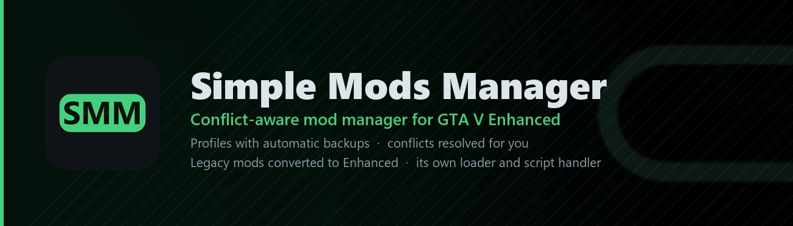
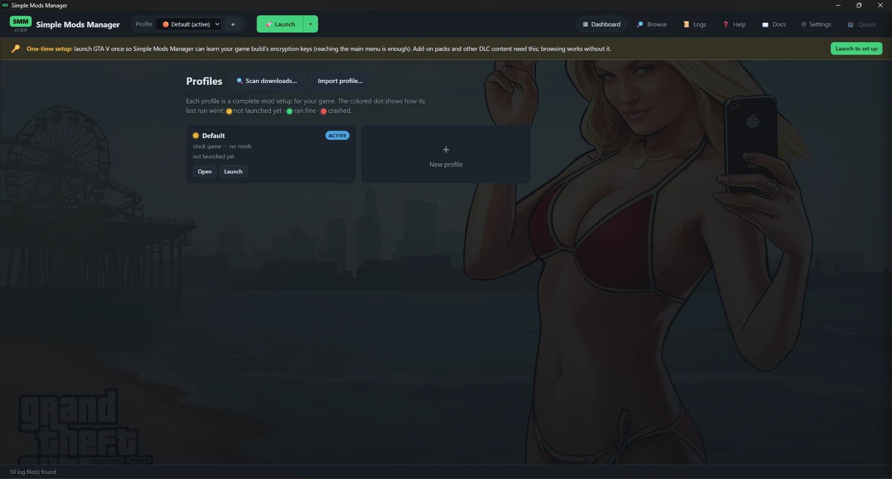

# Simple Mods Manager - User Guide

*Dashboard-first: your profiles live front and center, and the install wizard
only appears when you're actually installing something.*

Simple Mods Manager is a conflict-aware mod installer for **GTA V Enhanced**.
It ships its own mod loader *and* its own script handler, installs the other tools
mods need, and keeps every setup in a **profile** you can switch between safely -
with automatic backups and restore points before anything touches your game folder.

The app has a handful of areas, all reachable from the top bar:

- **Dashboard** - your profiles and their health.
- **Browse** - find and download mods from gta5-mods.com, Nexus Mods, GitHub
  releases, a Google Drive share link, or any direct download link.
- **Logs** - every log the game and loaders write, plus plain-language diagnosis.
- **Help** - quick FAQ answers, with a search box.
- **Docs** - this guide, right inside the app. When a page here links to a mod
  (like the spawn-list script further on), clicking it opens that mod's page
  *in* Simple Mods Manager, ready to install - other links open in your normal
  web browser.
- **Settings** - your game and downloads folders, how the app looks and behaves,
  the download cache, and optional accounts (GitHub, Nexus, Google).
- **📥 Queue & activity** - mods you've collected but not installed yet,
  plus everything Simple Mods Manager is doing in the background. The
  button sits at the end of the bar, counts what is waiting or running,
  and opens a drawer where downloads show live progress (and can be
  cancelled), finished tasks report their result, and the install queue
  waits below - it even survives closing the app: queued mods are
  restored on the next start, with a message saying so.

*A fresh install: one profile - **Default**, the stock game - and the one-time
setup banner. Everything starts here.*

!!! warning "Early days - expect bugs"

    GTA V Enhanced is a moving target and Simple Mods Manager converts mods for
    it automatically, so some mods will misbehave and some will crash the game.
    Your game folder is backed up before every install and a restore point puts
    it back, but please keep your own backup of anything you can't lose. Hit
    something broken? [Report it on GitHub](https://github.com/0x78f1935/SMM/issues)
    and attach your logs - that's what makes the next build better.

!!! tip "Verify your download"

    Every release publishes a `SHA256SUMS.txt` beside the app. To check that
    your copy is genuine and undamaged, open PowerShell in your download folder
    and run `Get-FileHash SimpleModsManager.exe` - the hash it prints must
    match the one in `SHA256SUMS.txt`.

New here? Start with [What SMM can - and can't - do](capabilities.md) for an
honest one-page summary of what the app, its loader and its script handler do
together. The app also
runs a short **guided tour** the first time you start it, and you can replay it
any time from Settings.

Two small behaviours worth knowing from day one: problems show up as a
**message in the bottom-right corner** (errors stay until you dismiss
them, so nothing important scrolls away), and only **one Simple Mods
Manager can run at a time** - starting a second one just tells you it's
already running, so two copies can never fight over your game folder.

## First launch - start from a fresh game

Simple Mods Manager must first meet your GTA V installation in a **clean,
unmodded state**. That is what makes the built-in *Default* profile
trustworthy: it always means "the stock game", and switching to it always
gives you a working vanilla install back.

- A fresh installation is adopted silently - you won't notice anything.
- If the game folder already contains hand-installed mods (loaders, a
  `scripts\` or `mods\` folder with files), the app shows a full-screen
  notice and exits. Remove those mods first (or verify/repair the game
  through your launcher so it is back to stock), then start Simple Mods
  Manager again and re-install your mods into a profile - safely managed
  from then on.
