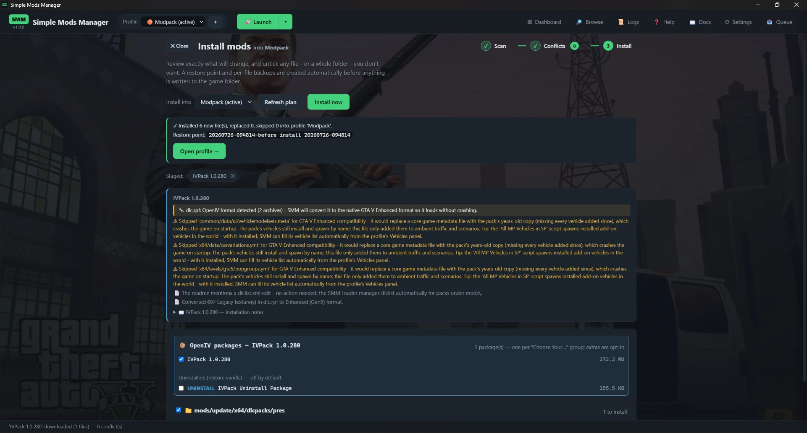

# Installing mods (the wizard)

The install wizard runs **Scan → Conflicts → Install**. It opens only when
you need it: from a profile's *📁 Install from folder*, after *Scan
downloads…*, or after a Browse download. Versions are read from inside the DLLs,
the newest is pre-selected, downgrades are flagged, and everything is backed
up and restore-pointed before the game folder is touched.

*The Install step for a large add-on pack. Note the restore point named up front,
the notes explaining what SMM changed and why, and the pack's own uninstaller
package left unticked so it can't run by accident.*

**The Scan step shows which folder it scans** - your downloads folder from
Settings - right above the *Scan now* button. **Change for this scan…** lets
you pick a different folder for that one scan (say, the dedicated folder you
just downloaded NaturalVision into) without touching the saved setting; *Use
saved folder* switches back.

**Two folders are never treated as mods**, and the scan notes say so when it
meets them: Simple Mods Manager's own `SimpleModsManager_data` folder, and your
game folder. Both are easy to end up scanning by accident - the data folder sits
next to the program, so keeping the program *in* your downloads folder puts it
right in the middle of everything being scanned - and neither one is a mod.

**Choose exactly what installs.** The Install step groups the plan by folder,
with a checkbox on every file and every folder. Untick anything you don't want
and it won't be installed. This is handy for mods that ship files for several
frameworks - e.g. **LemonUI** includes SHVDN, FiveM and RPH builds and tells
you to install only the one you use: keep the **SHVDN** folder ticked and untick
the rest. The mod's own installation notes are shown on this step to guide you.

**Optional add-ons start unticked.** When a download ships a *Main Package*
beside an *Optional Add-Ons* folder (NaturalVision does), each add-on's files
appear in the plan with a badge naming the add-on - unticked. Tick what you
want and it installs with the rest. An add-on that *replaces* one of the main
package's files shows up as a picker instead, with the standard file
preselected and the add-on's version as the alternative.

**Mods that add files inside another mod's pack.** A few mods don't bring files of
their own - they add files *into a pack you already have installed*. Long Travel Bus
Service and Los Santos Bus Service both do this: they put new bus routes and vehicle
files inside **Bus Simulator V**'s pack. Normally that needs a separate archive editor. Simple Mods
Manager does it for you: it writes the files straight into the installed pack, after
taking a copy of it first, and the install summary tells you which files were packed
that way. Uninstall the mod later and the pack goes back exactly as it was.

For this to work the pack it targets has to be installed already - so install
**Bus Simulator V first**, then the bus-service mod. If something can't be written
in (a file too large for the archive format, for instance), you get told which file
and why, rather than a vague note.

**Empty folders count too.** Some mods ship a folder with nothing in it on purpose -
Los Santos Bus Service ships empty *Routes* folders for you to save your own bus
routes into, and its script looks for them the moment the game starts. Simple Mods
Manager creates those folders as part of the install, and removes them again when you
uninstall the mod - unless you have put your own files in them, in which case they
stay exactly where they are.

**Fix a path.** Hover a file on the Install step and click the **✎** to change
where it installs - useful when a mod's own instructions put a file somewhere
SMM didn't auto-detect. Paths are relative to the game folder, forward slashes
(e.g. `mods/update/update.rpf/x64/textures/graphics.ytd/file.dds`). SMM checks
what you type against your real game files and fixes the exact archive path for
you.

**Needs a destination.** Sometimes a mod ships a file SMM can't place on its
own - a packed archive whose home is only mentioned in the readme, for example.
Those appear at the top of the Install step in a **"Needs a destination"** box
with a ✎ button; click it and set where the file goes. Until you do, that file
is left out of the install (everything else still installs). Often SMM reads
the destination straight from the mod's instructions and places it for you, so
the box stays empty.

SMM also checks the file's **name** against your game. Plenty of texture and prop
mods are just the file, with no folders around them and no instructions worth
following - but if the name belongs to exactly one file in the game, that is the
file being replaced, and SMM places it there. When the name isn't unique it asks
instead of guessing, so the box is still there when it's genuinely needed.

**Optional extras.** When a mod keeps something in a folder it calls *Manual
installation*, *Optional* or *Alternative*, and its notes say which file those
extras belong in, they appear on the Install step **switched off**. They're the
author's alternative route, not the main install - tick them if you want them.

**Choose a variant.** Some mods ship several copies of the same file for you to
pick between - the classic **low / medium / large** versions of a map's `.ytyp`,
for instance - where you're meant to drop one *into* the mod's `dlc.rpf`. SMM
shows these as a **"Choose a variant"** box on the Install step with a dropdown.
Leave it on **Packaged default** to install the mod exactly as it ships, or pick
a variant and SMM patches it into the archive for you before installing - no
extra tools needed.

The same box handles **presets**: script mods often ship their settings file in
one folder per preset - Glory's `Arcadey`, `Hardcore` and `Semi Realistic`, each
holding a `Glory.ini`. Only one of them can be the mod's settings file, so SMM
offers them as a single dropdown and installs the one you pick. Here there is no
"packaged default" to leave it on, because there is no single file the mod ships
by default - SMM pre-selects the first preset and you change it if you want
another. Switching the dropdown swaps the file immediately, so the list below
always shows the preset you'll actually get.

And it handles the bluntest case too: **one mod, several copies of the same file**.
*Faster Trains* ships four `traintracks.xml` in folders called `backup speed`,
`x2 speed`, `x3 speed` and `x4 speed` - all going to the same place, so only one can
win. Instead of four identical-looking rows where whichever came last quietly won,
you get one dropdown listing the four speeds and you pick your own.

**Files the mod's author marked optional stay switched off.** Mod authors often put
a condition in a folder name - `(OPTIONAL) free camera in metro`, or
`Package installer (Only if you have BSV)`. Simple Mods Manager reads those folder
names and leaves those files **unticked**, with a small yellow **optional** badge
showing the author's own wording. Nothing in a folder like that installs unless you
tick it yourself. Read the badge, decide if it applies to you, and tick it if it
does. This matters more than it looks: an optional extra installed without you
knowing is a very hard thing to blame later when the game misbehaves.

**Merge two gameconfigs into one.** Some mods ship their own `gameconfig.xml`
(an "increased limits" config). When two of them - or a new one and the one you
already have installed - land in the same profile, the Conflicts step doesn't
force you to throw one away: the conflict card gets a **🔀 Merge values…**
button. It lists every setting the files disagree on, with each file's number
side by side - pick the value you want per row, hit **Merge & use**, and a
single merged `gameconfig.xml` installs. Rows marked **🔒 SMM** aren't yours to
pick: Simple Mods Manager manages those values itself - the merge keeps the
highest one, and at every launch they're raised further to fit however many
add-on mods this profile actually has installed. Those automatic raises always
win, merged file or not.

A mod that ships its gameconfig inside an **.oiv package** (`.oiv`) is handled
without asking you anything, because those copies need care: they are almost
always built for GTA V Legacy, and next to the limits they raise they also carry
values *smaller* than Enhanced's own - installing one whole makes the game quit
during loading just as surely as having no extra room at all. So SMM takes only
the raises: every limit the pack asks for is applied to **your game's own**
gameconfig, and anything it would have lowered is left alone. The mod card lists
what was raised and how many values were ignored.

**Two mods that retexture the same thing both take effect.** Texture packs are
shipped as dictionaries - one file holding many textures - so two mods often want
the *same* file (`graphics.ytd`, say) while actually changing completely different
pictures inside it. Simple Mods Manager installs both and combines them texture by
texture, rather than making you sacrifice one. You'll still see a conflict card for
it, and it still matters: it decides which mod wins on any single texture they
*both* replace. Everything else from every mod involved lands either way, and you
can uninstall or reinstall one of them on its own without disturbing the rest.

**Choose which .oiv packages install.** Some mods ship as an `.oiv` installer - SMM applies these for you, no extra tools required. When a download
bundles **several** `.oiv` packages (a base pack plus its uninstaller, or optional
extras), the Install step shows an **".oiv packages"** checklist with each
package's name and size. Changing a tick re-maps the mod instantly, so the file
list below always reflects exactly what will install.

A download can also bundle an `.oiv` as an **optional extra alongside the actual
mod** - Glory ships its script and presets next to an `Animation_Fix.oiv` that
fixes one specific annoyance. SMM installs both: the mod's own files *and* the
packages you leave ticked. Unticking every package still installs the mod itself.

For a big configurable pack (like VisualVanilla), the checklist is organised for
you: each **"Choose Your …"** category - lens flare, starfield, sky colours, moon
size, sun position, emissives - is a **pick-one** group (its options are
alternatives that would clash if you installed more than one), and SMM works out
which options conflict automatically. Each group starts on the pack's recommended
default, with a **None** choice if you want to skip it. The core/base package stays
on, and the extra one-off tweaks (Misc Optionals, Effects Reduction, extra shaders)
start **off** so you opt into just the ones you want. The pack's own
**uninstaller** packages start unticked so they never run by accident. **Hover** an
option to see its preview image.

The line under the ".oiv packages" heading always tells you what that particular
checklist is asking - pick one per group, tick what you want, or "all optional".
And when a mod gives two packages the **same name** - which happens most often when
it ships one package per game edition - Simple Mods Manager adds whatever tells them
apart, in brackets: the edition when that is the difference (*Cops On Patrol
(Enhanced)* and *Cops On Patrol (Legacy)*, with the Enhanced one already picked for
you and the group headed **Game edition**), otherwise the folder each came from
(*Weather Tweaks (Night)* and *Weather Tweaks (Day)*). A name that was already
unique is left exactly as the author wrote it. Packages
the author put in a conditional folder show the same yellow **optional** badge as
files do, and start unticked.

**Visual & config overhauls work too.** `.oiv` mods that don't just add files but
**tweak** the game's weather, timecycle and visual-settings files (big graphics
overhauls like VisualVanilla, with "Configure It" options for sky colours, sun
position, moon size, lens flares…) are applied properly: SMM edits those text
files and delivers the result as a normal overlay. Tick the base package plus the
options you want - because packages apply **in order**, each option's tweak builds
on the base, exactly as the game expects.

Even the bigger pieces work: a pack that adds a whole **map add-on** (like
VisualVanilla's *Map Enhancements* - tree reflections, mirror-park lake) ships as a
stub archive plus separate map files, and SMM assembles them into one proper add-on
package and converts its older-format models to Enhanced automatically. If a package
still does something SMM can't express (for example deleting base-game files), the
mod's card lists it as a manual step so you know what wasn't applied, rather than
pretending it was.

**No installable files.** If a download unpacks fine but contains nothing to
install - a broken or stub upload (some mod pages serve a tiny placeholder file),
a docs-only archive, or a mod whose real files are hosted on another site - its
card shows a clear warning saying nothing will be installed and to check the
mod's page (or download it manually). It won't sit there as a puzzling
"0 file(s) mapped".

**Installing doesn't lock you out.** Confirm on the Install step and the
wizard closes: the install runs **in the background** while you keep
using the app - browse for the next mod, read logs, whatever you like
(the 📥 button tracks it, and the game folder itself is still written by
one operation at a time, so nothing can interfere). When it finishes, the
full install summary appears - what was installed, what was superseded,
the restore point taken, and anything skipped with its reason - with an
**Open profile →** button straight to the result. If it fails, the queue
is kept so you can fix the cause and press 📥 to resume where you were.
Even closing the window mid-install is safe: Simple Mods Manager tells
you it is finishing the current operation, completes the write, and then
closes itself - a game-folder write is never cut off halfway.

Changed your mind about a mod? Every card on the Scan step has a **✕** button
that removes it from the batch, and the Install step lists each staged mod as
a chip with its own **✕** - so you can drop a mod right before installing,
wherever you are in the wizard. Nothing already installed is touched. Once an
install finishes, the queue is cleared automatically.

If a staged mod says it **needs another mod** (e.g. LemonUI or ScriptHookVDotNet)
that your profile doesn't have yet, the Scan step shows a **Required by your
mods** panel and looks it up on gta5-mods - click **＋ Add to queue** to install
it alongside, or open the search if there's no clear match.

When a mod ships installation notes in its readme, its card on the Scan step
shows a **📖 Readme installation notes** section - click it to fold the full
text open. Links in readme notes and warnings are clickable: gta5-mods.com
mod links open inside the app (so you can download a requirement on the
spot), everything else opens in your browser.

Some mods ship files for both GTA V generations in one download (a *Legacy*
folder and an *Enhanced* folder). Simple Mods Manager manages GTA V Enhanced,
so it automatically installs the Enhanced files and skips the Legacy ones -
the mod card tells you when that happened.

**Legacy textures are upgraded automatically.** GTA V Enhanced ignores textures
saved in the old Legacy format, so a Legacy texture mod would otherwise show
nothing in-game - a retextured map or vehicle, for instance, would leave the
default one on screen. Simple Mods Manager rebuilds those textures into the
Enhanced format as it stages the mod (the picture is copied exactly - no quality
loss), so they appear in-game with no extra step - with a live progress bar while
a big pack converts. Binary settings files (`.ymt`) built for Legacy are upgraded
too: your mod's values are carried over onto the Enhanced game's own version of
the file, so the tweak works without handing the game data in an outdated shape. **Legacy models are upgraded the same way** - drawables and
drawable dictionaries (`.ydr`/`.ydd` - props and map pieces) and fragments
(`.yft`, including **add-on vehicles** with glass and cloth bodies) are rebuilt
into the Enhanced format; collision files (`.ybn`), nav meshes (`.ynv`) and
animation clips (`.ycd`) are identical on both editions and install as they are.
In the rare case a model uses a feature the converter can't rebuild, the mod card
warns you; a mod that converts cleanly gets no warning.

**Vehicle *replacements* are placed for you.** Some car mods don't add a new
vehicle - they *replace* a stock one, and ship their files named after that stock
car (`vacca.yft`, `adder.ytd`, …) with no folder structure. Simple Mods Manager
recognises those names, finds where the game keeps that vehicle, and installs the
mod's files right over it - no "where does this go?" prompt. If a single mod
offers **both** an add-on version (a `dlc.rpf` pack that adds the car under its own
name) **and** the loose replacement files, SMM installs the add-on and skips the
replacements, so you don't overwrite a stock car by accident; the mod's card says so.

**A pack that ships an empty parts archive is called out before you install it.**
A car's tuning parts (bumpers, hoods, spoilers) live in their own archive, and the
pack's data file declares which one to use. Some downloads declare it but ship that
archive **empty** - the car then appears in a trainer, and spawning it takes the
game down. Simple Mods Manager spots that on the Scan step and says so. It cannot
be repaired: the parts were never in the download, so this is one for the mod's
author. The rest of the pack installs fine.

Debug symbol files (`.pdb`) are useless in-game, so Simple Mods Manager skips them
by default. Turn on **Install debug files** in Settings if you actually want them
(e.g. for mod development).

**Reinstalling walks the steps again.** *Reinstall* on a mod's card re-unpacks it
from your download and re-opens the wizard, with **your previous choices already
selected** - the optional packages you ticked, the variant or preset you picked,
and the files you left out. Change whatever you want and install; that is usually
the reason you hit Reinstall in the first place. The copy you already have stays
in place until you actually confirm the install, so backing out of the wizard
leaves your profile exactly as it was.

**Install order is remembered.** When two mods ship the same file, the one you
installed *later* wins. Simple Mods Manager records that order, keeps it when you
reinstall a mod (so re-applying a mod never quietly reshuffles who wins), and
exports it with the profile - so an imported profile is rebuilt in the same order
and ends up as the same setup.

Readme install instructions are followed even when they're written casually,
so files a mod's author says to drop in a specific place end up exactly
there. That includes the way such packages write a location -
`Mods / update / update.rpf / x64 / data / metadata`, spaces and all - and
readmes tucked away in a wrapper folder beside the actual mod files, readmes
written as a **web page** rather than plain text, destinations written on
their own line under a colon, and instructions laid out as **numbered steps** -
"1. go to this folder … 3. replace this file" - where the folder and the file are
several lines apart. If a mod's readme turns out to be nothing but a
link to the author's documentation site, Simple Mods Manager follows that link
once to read the instructions there - it only does so when the shipped readme
says nothing itself, and if the site can't be reached the install simply carries
on without it. Some authors
also ship their files under a `platform` folder, which is the game's own name for
part of `update.rpf`; Simple Mods Manager checks that against your real game
files and, when it matches, places them for you. And re-installing or updating a mod never conflicts with its own
earlier copy - Simple Mods Manager tracks what it installed.
