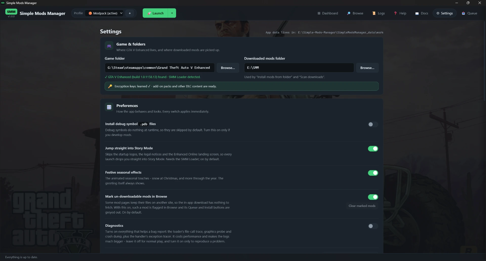

# Settings

Settings is organised into titled cards: **Game & folders**, **Preferences**
(one row per setting, each with its explanation on the left and its switch,
dropdown or button on the right), **Accessibility**, the three optional **connection**
cards side by side (GitHub, Nexus Mods, Google - each with a small
*how to get one* expander), the **Download cache**, and **About &
credits** at the bottom. (Restore points are not here - each profile lists its
own on its profile page, below the benchmarks.) The background can fade
gently through all of the bundled wallpapers (the default), stay on a single
one you pick, or be turned off for plain dark. The status
bar shows where the app keeps its data: a `SimpleModsManager_data` folder
next to the executable - the whole setup is portable. Set `SMM_DATA_DIR` in a
`.env` file to relocate it (see `.env.example`).

The game-folder line shows your **GTA V Enhanced build** (e.g. `1.0.1158.13`) when
a valid folder is set - worth quoting whenever you report a problem, since a
Rockstar update can change what a mod does.

**Encryption keys.** Just below the game folder, a status line shows whether Simple
Mods Manager has learned your build's encryption keys. Add-on packs and other DLC
content need them, and they can only be read by running the game once with the loader.
When they're missing it reads *"not learned yet"* with a **Launch to set up**
button (reaching the main menu is enough); once learned it shows a green
*"learned ✓"* - the keys are kept in your portable data folder, so they survive
across sessions and you won't be asked again. A **Legacy mod's audio** needs a second
key of its own; Simple Mods Manager works it out from your game the first time it
converts a mod's audio and keeps it in the same folder, so that one never asks you for
anything extra - but it does need the keys above, which is why the same one-time launch
covers both. (The same one-time prompt also
appears as a banner on the dashboard until the keys are learned.)

On that first key-learning launch, if your profile has no add-on packs to prepare,
the game **closes by itself** once it has handed over the keys and shows a small
*"encryption keys obtained - please start GTA V again"* message. Just launch once
more and your mods load from that run. (When the profile does include add-on DLC
packs, SMM instead loads them during that same first launch, so there's no restart.)

**Nexus Mods store.** Nexus keeps **GTA V Enhanced** and **GTA V Legacy** as two
separate games, each with its own mods - something listed on one is not listed on
the other. This picks which of them Browse opens. Simple Mods Manager asks you once,
the first time you open the Nexus tile, and remembers the answer; this row and the
**Store** dropdown in the Browse bar both change it afterwards.

**Which version to install.** Some mod pages list several versions and label them
*Enhanced* or *Legacy*. By default Simple Mods Manager installs **the newest one
that isn't marked Legacy** - so an Enhanced build still wins over a newer Legacy
one, but an old *Enhanced* label doesn't beat a newer release that simply doesn't
say. Switch it to **Always install the newest version** if you'd rather have the
latest file whatever it's labelled. Either way you can pick a version by hand on
the mod's page, and dependencies like Script Hook V .NET always take their Enhanced
build - a Legacy one wouldn't load at all.

**Festive seasonal effects.** On by default - the animated seasonal touches,
like snow falling at Christmas, with more through the year. Purely decorative
and never in the way; turn it off here if you'd rather not have the animations.
(On a festive day a short greeting still appears as a banner across the top -
that friendly hello is always there.)

**Accessibility** has a card of its own, with five options that make the app
easier to read and calmer to look at. Each applies the moment you set it, and
is remembered for next time.

**Text size.** Scales all the text in the app - *smaller (90%)*, *normal*,
*larger*, *large* or *largest (150%)*. The rows, buttons and cards grow with the
text rather than staying put and clipping it. You can also hold **Ctrl** and
scroll your mouse wheel anywhere in the app to step through the same sizes,
just like in a web browser - including on this Docs page, which resizes with
everything else.

**Reduce motion.** Turns off the animations, the background slideshow and the
seasonal effects, leaving everything in place but still. Until you touch this
switch it follows the animation setting in Windows itself, so if you have
already asked Windows for less movement, Simple Mods Manager is calm from the
first start without your having to ask twice. Setting it here overrides that
either way - so you can keep the seasonal effects even with the Windows setting
on, if that is what you would rather have.

**High contrast.** Brighter text, clearly visible outlines, and solid card
backgrounds so a background image never sits behind the words you are reading.
Text in this mode is held to the strictest of the common readability
standards.

**Underline links and thicken the focus outline.** Links stay underlined
instead of only underlining when you point at them, so you can find them
without relying on their colour, and the outline that follows the keyboard
around the screen becomes thicker and easier to spot.

**Colourblind-friendly colours.** Swaps the green, amber and red used for
status so they stay clearly apart with red-green colour blindness - success
moves from green to blue, warnings gain brightness, and errors move towards
pink. Nothing else about the app changes.

Whether or not you turn that last one on, status is never told by colour alone
anywhere in the app: the profile health markers differ in **shape** (a filled
circle ran fine, a hollow ring has not been launched yet, a square crashed),
and warnings and errors carry a **symbol** as well as their colour. The
colourblind palette makes that easier still, but the app is readable without
it.

**Let Windows Defender skip the game folder.** Defender scans every file the game
loads. That slows launches down, and it sometimes deletes mod files outright after
mistaking them for threats - a script mod is, structurally, an unsigned program being
loaded into a game, which is exactly the shape a virus scanner is built to be
suspicious of. This tells Defender to leave the game folder alone.

Simple Mods Manager offers this by itself the first time it learns your game's
encryption keys, and this row is how you change it afterwards. Windows asks for
administrator permission every time - there is no way around that, and declining is
fine, nothing else changes.

It only ever removes the exclusion **it** added, never one you set up yourself, and
*Put my game back* in the Danger zone removes it for you. Only the game folder is
ever excluded: your downloads folder is not, because Simple Mods Manager
deliberately scans downloads before unpacking them.

One quirk worth knowing: Windows will not tell an ordinary program which folders are
excluded, so if you added an exclusion yourself the switch shows **off** even though
Defender is already skipping the folder. Press **Check Windows** to ask properly -
that needs administrator permission too, which is why it is a button rather than
something that happens every time you open this page.

**Graphics card.** Which card Simple Mods Manager's own in-game parts use. The
dropdown lists the cards found in your PC, with how much memory each one has, so
a laptop's built-in chip is easy to tell apart from the fast one. Leave it on
**Automatic** - which picks the fastest card - unless your game starts on the
wrong one. It takes effect the next time you launch.

This does **not** change the game's own graphics settings, and it is not a
performance switch. It exists because on laptops with two graphics chips the
in-game parts used to ask for whichever chip the screen is wired to, and that
could pull the whole game onto the slower built-in one. Windows has its own
per-game preference under *Settings → System → Display → Graphics*, and your
graphics driver has one too; if a game is on the wrong card, those are worth
checking as well.

**Profile order.** How your profiles are listed everywhere - the dashboard grid,
the profile picker at the top, the launch menu and the wizard's *Install into*.
Choose *last played first* (the default), *name A → Z* or *name Z → A*. The
reserved **Default** profile is always listed first whichever you pick: it's your
stock, unmodded game and the thing you go back to. A profile you have never
launched from Simple Mods Manager sorts to the end of the "last played" list -
there's nothing to sort it by yet.

**Guided tour.** *Replay the tour* walks you through the app again - profiles,
finding and installing mods, the three install steps, launching, and this page.
On the two install steps it fills the screen with a worked **example** (a conflict
between two mods, and a small install plan) so you can see what they look like
before you have anything staged; it's clearly labelled, it isn't real, and it
disappears when the tour ends. The tour runs once by itself the first time you
start Simple Mods Manager; you can skip it there and come back to it here whenever
you like.

**Mark un-downloadable mods in Browse.** On by default. A few gta5-mods.com pages
keep their actual files on a different website, so Simple Mods Manager's in-app
download has nothing to fetch and stops with a "couldn't find the file" message.
With this on, such a mod is remembered and flagged in Browse - a **Download
location invalid** badge with its **Queue** and **Install** buttons greyed out, on
both the result card and the mod's page - so you don't keep clicking a mod that
can't be installed here (you can still open its page to download it by hand). The
mod is never hidden from your results. Turn this off to treat those mods normally
again; the **Clear marked mods** button below forgets every mod flagged so far.

**Jump straight into Story Mode.** On by default. The mod loader takes the game
straight past the **startup logos and legal notices** *and* the **Enhanced Online
landing screen** (the one where you'd choose between Story Mode and GTA Online), so
every launch drops you into Story Mode with nothing to sit through or click. It
needs the SML loader present (the same one that loads your mods); if a game update
ever moves the code it can't find, it quietly does nothing and the startup plays as
normal. Untick it here to keep the original intro videos and the landing screen.

**GitHub token.** Optional. SMM asks GitHub for version information in several
places - some of the managed dependencies, any mod you installed from a GitHub
release, and SMM's own update notice - and GitHub lets anyone ask only **60 times
an hour per IP address** without signing in, a budget you share with everyone else
on your connection. If it runs out, the check fails with *"rate limit exceeded"*;
your mods and your game are entirely unaffected, and it clears on its own within
the hour.

To stop it happening at all, paste a **personal access token** here:

1. Go to [github.com/settings/tokens](https://github.com/settings/tokens) →
   *Generate new token (classic)*.
2. Tick **no scopes at all** - it only reads public release pages.
3. Copy it into Settings → **GitHub token** → *Save*.

That raises the limit to 5000 an hour. The token is checked with GitHub before it's
saved (so a mis-paste is caught immediately), stored with your other settings in your
portable data folder, and sent to nobody but GitHub. **Clear** removes it and goes back
to anonymous checks.

**Nexus Mods API key.** Optional. Your personal Nexus key lets SMM browse the **Nexus
Mods** tile (and download in-app on Premium accounts). Find it on your
[Nexus Mods API keys page](https://next.nexusmods.com/settings/api-keys) ("Personal API
Key"), paste it into Settings → **Nexus Mods API key** → *Save*, and **Clear** to
disconnect. You can also connect it from Browse → Nexus Mods; either place works. It's
stored in your portable data folder and only ever sent to nexusmods.com.

**Google API key.** Optional, for the **Google Drive** tile. Without one, SMM installs
single Drive files fine but has to scrape the public page for *folders*, which Google
breaks and rate-limits. A free key makes folder downloads reliable: in the
[Google Cloud Console](https://console.cloud.google.com/) make a project, enable the
**Google Drive API**, create an **API key**, then paste it into Settings → **Google API
key** → *Save* (or into the Google Drive prompt). **Clear** removes it. It's stored in
your portable data folder and only ever sent to Google.

**Download cache.** Every mod and dependency you download is kept in a shared
cache, so the same version is fetched from the internet only once and reused
across every profile that installs it - faster installs, less disk, and instant
profile imports for anything you already have. Settings shows how much space the
cache uses and a **Clear cache** button to empty it (SMM re-downloads
anything it needs again later). **Show downloads** expands the full list - every
cached mod and dependency with its version, file name, size and date - and each
row has a ✕ to remove just that download. Removing a cached download never
touches your installed mods; it only means SMM would fetch that file again the
next time a profile needs it.

## Development

The last of the everyday cards holds the three switches that exist for *building*
Simple Mods Manager and for reporting bugs against it. None of them change how the
game plays, and all three are off by default - if you're not chasing a problem,
there's nothing here for you.

**Install debug files.** Mods sometimes ship `.pdb` debug symbol files that do
nothing at runtime; Simple Mods Manager skips them unless you turn this on (useful
only if you develop mods).

**Diagnostics (leave off).** One switch turns on everything that helps a bug
report - the loader's file-call trace, graphics probe and crash dump, plus the
handler's exception tracer. It costs performance and makes the logs much
bigger, and the normal logs already contain everything a routine report needs
(versions, your game build, the mods served, which plugins loaded) - so keep it
off unless a maintainer asks, then: turn it on, reproduce the problem, send the
logs.

**Developer bridge.** Lets Simple Mods Manager's own development tools read and
control the game while it runs, over a private connection on this PC - it is for
building and testing SMM itself. Single player only. While it is on, the game will
not pause when you click away from it (it can't answer while paused); turning it
off restores that.

**SMM updates itself.** The startup version check also asks GitHub for the
newest released SMM - and unlike the mod and dependency checks, that one is made
**every time you start the app**, so a new release shows up straight away instead
of whenever the shared six-hour check next comes round. It is a single request.
When a newer
release exists, a small **⬆ v… available** pill (naming the new version) appears next to the version in
the top-left - and a full-width banner across the top of every screen - with an
**Update & restart** button: SMM downloads the new version, verifies it, swaps
itself out and restarts. (The banner's **Later** hides it until the next
launch; the pill stays.) Your profiles, mods and
settings live in the data folder next to the exe and are untouched. (Windows
SmartScreen may warn once about the freshly downloaded exe - expected for a
small unsigned project.) The About card links the releases page if you prefer
updating by hand. No pill means you're current.

At the bottom, **About & credits** shows the app version (with an update link
when a newer release exists), quick links to the documentation and the
bug-report page, and the support row - star it on GitHub, endorse it on Nexus
Mods, like it on gta5-mods, or buy the author a coffee. Most open in your
normal web browser; **👍 Endorse** endorses on Nexus Mods in-app - if your
Nexus account isn't connected yet it asks for your API key first, then
endorses.

Below that, two credit walls give the people behind the project their due:
**The managed dependencies** - one card per dependency Simple Mods Manager
installs and keeps up to date, each with its author, what it does, and a link
to its home: SMM's own Loader and Handler (SMH), plus Script Hook V .NET
Enhanced by Chiheb-Bacha, iFruitAddon2 by Bob74, NativeUI by Guad and LemonUI
by justalemon -
and **Standing on the shoulders of**, the tools whose ideas SMM's own loader
and handler were inspired by (Script Hook V, ScriptHookVDotNet by crosire &
contributors, Simple Mods Loader Enhanced by NativeCoder, OpenIV, CodeWalker,
and of course Rockstar's Grand Theft Auto V). The lists come straight from the
app itself, so a newly added dependency shows up here automatically. This guide
is always available from the **Docs** tab in the top bar.

## Danger zone

Below the everyday settings, just above **About & credits**, and the only card
that can throw work away. Three actions, each of which explains exactly what it
will remove before it does anything.

**Restore my game.** Removes everything Simple Mods Manager put in your game
folder and puts your original files back, so the game runs exactly as it did
before you ever installed it - no loader, no mods, no changed launch options. A
restore point is taken first. Your profiles are **kept**, so this is the one to
reach for when you want a clean game for a while: install a profile again
whenever you like and everything comes back.

If a file that a mod replaced can't be put back - because the untouched original
went missing at some point - it says so by name instead of quietly leaving it
there. Verifying your game files through Steam or the Rockstar launcher fixes
those.

**Delete all Simple Mods Manager data.** Erases your profiles, the install queue,
downloaded files and backups. Your settings, your API keys and the encryption
keys learned from your game are **kept** - so you don't have to set the app up
again or launch the game to re-learn its keys.

This one asks you to **restore your game first**, and refuses until you have. The
untouched copies of files your mods replaced are part of the data it would
erase - delete them while mods are still installed and there would be no way to
put your game back.

**Reset everything.** Both of the above in one go, and then Simple Mods Manager
closes. Open it again and it behaves like a fresh install, but with your settings
and keys already in place. This also removes the Explorer icon registered for
`.smmprofile` modpack files - though if you keep using the app it registers
itself again next time it starts, which is correct: the icon describes an app
that is still there.

**Confirming.** The two that cannot be undone show you five random words and ask
you to type them. You can't paste them - typing them is the point. Type them
wrong and nothing happens at all. It is deliberately more effort than a button:
these remove work you can't get back.
